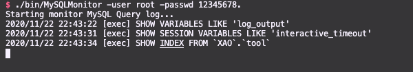

# MySQLMonitor

最近在学习 SQL 注入，发现 [MySQLMonitor](https://github.com/TheKingOfDuck/MySQLMonitor)项目用 golang 也写了个。

[bin/MySQLMonitor](./bin/MySQLMonitor) 可在 macos 下运行，其他系统自行编译。

## Usage
```bash
$ ./bin/MySQLMonitor 
Usage: MySQLMonitor [options]

  -h    Shows usage options.
  -host string
        Bind mysql host. (default "localhost")
  -port uint
        Bind mysql port. (default 3306)
  -user string
        Select mysql username.
  -passwd string
        Input mysql password.
```

**Demo**



## TODO
发现问题，